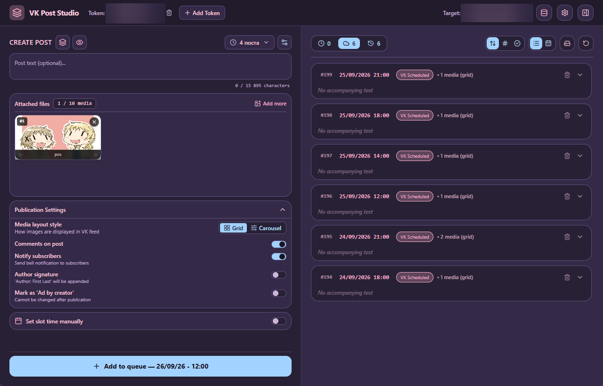

# VK Post Studio

<div align="center">

**English** | [Русский](README.ru.md)

<br/>


-003B57?style=for-the-badge&logo=sqlite&logoColor=white>)


<br/>

**Native Desktop Publishing Suite & Automated Queue Manager for VK (VKontakte)**

_High-performance desktop application designed for community administrators, and content creators._

<p align="center">
  
</p>
</div>

---

## !WARNING!

**VPN / Network Proxy Notice:**
- Make sure to disable your VPN before using the application, or ensure you use the **exact same VPN/proxy** both in your browser when generating the access token and at the system level while running the app.
- VK (VKontakte) security filters actively track IP address changes and may invalidate your access token or temporarily block API requests if the authorization IP does not match the publishing IP.

---

## VK Post Studio features

- **Smart Pattern Scheduling:** Define your posting schedules once (e.g. 14:00, 18:00, 21:00 every 2 days), and let the automated **Pattern Engine** calculate all slots with zero collision or human error.
- **Batch Queue Generator:** Drop hundreds of images, pick a layout scheme (1, 2, or 4 images per post), and generate weeks of structured queued posts in seconds.
- **Authentic VK Smart Grid Preview:** View an exact, responsive simulation of how your images and text will look in the VK feed before scheduling.
- **Full-Resolution Lightbox Viewer:** Inspect high-resolution originals and thumbnails instantly with one click.
- **Safe & Fast Disk Space Reclamation:** Free up disk space after transferring content to VK: the application safely moves uploaded original files to the OS Recycle Bin, or completely removes them from disk, while keeping fast local thumbnails and cloud URLs intact.
- **Interface Customization:** a few visual themes and full English and Russian localization.
- **Only text and images are supported now.**

---

### 1. Smart Pattern Engine

Automate slot distribution effortlessly. Specify publishing times (e.g. `10:00, 15:00, 20:00`), select intervals in days (`1` = daily, `2` = alternate days, `N` = custom interval), and let the engine assign collision-free slots automatically.

### 2. High-Speed Batch Generation

Turn raw assets into a scheduled queue in seconds. Select dozens of images from your hard drive, pick whether to bundle them as single posts, pairs, or quad grids, append a universal caption or hashtag set, and submit. The app handles chunking, ordering, and timing.

### 3. Community Wall Viewer

Inspect your target community wall directly inside the app. Fetch published posts with 30-item pagination, review engagement metrics, and download high-resolution photos back to your computer.

### 4. Intelligent Background Transfer Worker

When you hit **"Send to VK"**, our resilient background worker handles the end-to-end pipeline:

- Transcodes BMP and TIFF images to optimized JPEGs on the fly via the `image` crate.
- Uploads images to VK upload servers (`photos.getWallUploadServer`).
- Schedules posts via `wall.post` retaining all custom parameters (comments, carousel mode, author attribution, ad flags).
- Automatically delays expired slots (+2 minutes) to prevent scheduling rejections.
- Injects randomized jitter pauses (2–4 seconds) between requests to protect your account against spam filters.

---

## Quick Start

### Download Pre-Builded Release from Github

Just download portable binary or setup package for you system from release page and run the application.

### Installation from Source

Make sure you have [Node.js 20+](https://nodejs.org/) and [Rust 1.77+](https://rustup.rs/) installed on your machine (with C++ Build Tools on Windows).

```bash
# Clone repository
git clone https://github.com/ggghbc/VKPostingTool.git
cd VKPostingTool

# Install frontend dependencies
npm install

# Run the app in development mode
npm run tauri dev
```

### Packaging a Release Binary

```bash
# Build production executable and installer
npm run tauri build
```

Binaries and setup packages (`.exe`, `.msi`) will be generated inside `src-tauri/target/release/bundle/`.

---

## Workflow Walkthrough

1. **Add Token:**
    - Click **+ Add Token** in the header.
    - Click **Open login window in browser** to authorize via VKontakte.
    - Authorize permissions and copy the full URL from the browser address bar.
    - Click **Paste** and confirm. The token is safely stored into the OS Credential Manager, and your managed communities are automatically loaded.
2. **Select Target:**
    - Choose your target community or personal profile from the header dropdown.
3. **Configure a Schedule Pattern:**
    - Open pattern settings (clock icon) and create a schedule (e.g. `3 posts daily at 14:00, 18:00, 21:00`).
4. **Draft Post or Batch Generate:**
    - Type text, drag images onto the editor, or use `Ctrl+V` to paste images directly from your clipboard.
    - Alternatively, open **Batch Mode** to schedule dozens of posts from an image folder.
5. **Review & Preview:**
    - Click the **Live Preview (Eye)** icon to verify how the publication looks in the simulated VK newsfeed.
6. **Publish to VK:**
    - Click **Send to VK** in the Queue panel. Sit back while the background worker uploads photos and queues them directly onto the VK.
    - Click **Send to VK** again if there are a few posts with errors left. (could not process file (empty response error))
7. **Clean Disk Space:**
    - Click **Clean Local Files** to safely recycle original disk files for already postponed posts, while preserving fast thumbnails and cloud URLs.

---

## Security & Privacy

- **Token Isolation (TokenVault):** Access tokens and credentials are never stored in plain text in database files or disk logs. They are managed through the OS security subsystem (Windows Credential Manager).
- **No Remote Telemetry:** The application makes zero connections to any server other than official VKontakte endpoints (`api.vk.com`, `oauth.vk.com`).
- **Local SQLite Storage:** Queues, patterns, and image paths remain exclusively in your local user directory (`%APPDATA%/com.vkpoststudio.app/`).
- **Isolated Permissions:** Configured under Tauri 2.0 security boundaries (`capabilities/default.json`), limiting application access strictly to required dialogs and filesystem scopes.

---

## Complete Documentation Hub

For in-depth guides, technical references, and developer documentation, explore our dedicated guides:

| Document                                                     | Description                                                                                              |
| ------------------------------------------------------------ | -------------------------------------------------------------------------------------------------------- |
| **[System Architecture](docs/ARCHITECTURE.md)**              | Deep dive into Tauri 2.0 dual-layer design, Rust Tokio services, SQLite schema ERD, and state lifecycle. |
| **[Getting Started & Build Guide](docs/GETTING_STARTED.md)** | Prerequisites, local development setup, compiler toolchains, and release packaging instructions.         |
| **[Feature Catalog & Walkthrough](docs/FEATURES.md)**        | Exhaustive breakdown of every screen, button, flag, modal, and shortcut in the application.              |
| **[VK API & Security Model](docs/API_AND_SECURITY.md)**      | VKontakte API endpoints, OAuth Implicit Flow, permission scopes, rate limits, and data privacy.          |

---

## Technology Stack

| Domain                  | Technology                                                                            | Description                                                                             |
| ----------------------- | ------------------------------------------------------------------------------------- | --------------------------------------------------------------------------------------- |
| **Runtime & Shell**     | [Tauri 2.x](https://tauri.app/)                                                       | Secure, low-memory OS Webview bridge written in Rust                                    |
| **Backend Core**        | [Rust](https://www.rust-lang.org/) (2021 Edition)                                     | Systems language delivering speed, concurrency, and memory safety                       |
| **Async Runtime**       | [Tokio](https://tokio.rs/)                                                            | Multi-threaded non-blocking runtime powering background workers                         |
| **Credential Security** | [Keyring](https://crates.io/crates/keyring)                                           | Native OS credential manager integration (Windows Credential Manager)                   |
| **Database**            | [SQLite 3](https://www.sqlite.org/) + [SQLx 0.8](https://github.com/launchbadge/sqlx) | Embedded database with connection pooling, WAL journal mode, and FK cascade enforcement |
| **File Deletion**       | [Trash 5.2](https://crates.io/crates/trash)                                           | Instant cross-platform deletion to OS Recycle Bin                                       |
| **Image Processing**    | [Image 0.25](https://crates.io/crates/image)                                          | Decoding and on-the-fly transcoding of BMP/TIFF to JPEG                                 |
| **HTTP & Networking**   | [Reqwest 0.12](https://github.com/seanmonstar/reqwest)                                | Fast asynchronous HTTP client with multipart/stream upload capabilities                 |
| **Frontend Framework**  | [React 19.3](https://react.dev/)                                                      | Modern UI library utilizing functional components and hooks                             |
| **Language**            | [TypeScript 7.0](https://www.typescriptlang.org/)                                     | Strongly typed JavaScript ensuring compile-time safety                                  |
| **Build Tool**          | [Vite 8.x](https://vitejs.dev/)                                                       | Next-generation frontend tooling with instant Hot Module Replacement (HMR)              |
| **Styling**             | [Tailwind CSS 3.4](https://tailwindcss.com/)                                          | Utility-first CSS framework wired to dynamic CSS theme variables                        |
| **Icons & UI**          | [Lucide React](https://lucide.dev/)                                                   | Consistent, crisp iconography                                                           |
| **Date Engine**         | [date-fns 4.x](https://date-fns.org/)                                                 | Modern modular date manipulation library with local timezone support                    |

---

## Community & Support

- **Author / Developer:** [@ggghbc](https://github.com/ggghbc)
- **Support the Project:** Support development and upcoming features via [Boosty](https://boosty.to/ggghbc).

---

## License

This project is licensed under the **MIT License** — see the [LICENSE](LICENSE) file for details.
